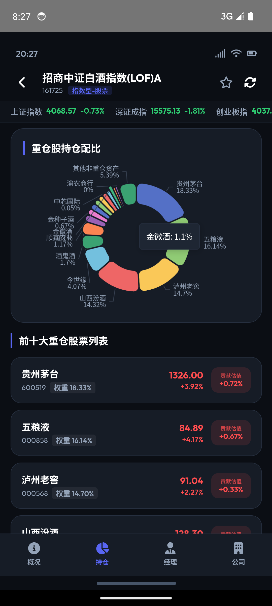

# 天天基金估值助手 (Fund Valuation Assistant)

一个优雅、现代且完全独立的基金实时估值与持仓分析工具，支持作为 **Web 浏览器应用** 或 **原生 Android 应用 (APK)** 运行。



---

## 🌟 核心特性

1. **完全独立的离线原生网络拦截 (`MainActivity.kt`)**
   * Android 客户端不需要本地 Node.js 服务器运行。
   * 通过 Kotlin 覆写 WebViewClient 中的 `shouldInterceptRequest` 方法，所有 `/api/...` 网络请求均被 native 进程拦截，在 native 线程直接发起对新浪财经 API 及天天基金官方接口的请求，进行 GBK 解码及 HTML 正则解析后，将 JSON 数据回填至前端。

2. **自选估值列表 (Watchlist)**
   * 启动即默认进入自选列表，实时展示您关注的所有基金当前的日内最新估值变化。
   * 支持一键星标收藏与删除，自选数据保存在本地安全沙盒（`localStorage`）中。

3. **双重市场行情板 (Market Tickers)**
   * 包含 A 股大盘指数（上证指数、深证成指、创业板指、沪深300）。
   * 包含美股主要指数（道琼斯、纳斯达克、标普500）。
   * 实时拉取最新数据，精准识别 CN/US 交易时区和涨跌幅规则。

4. **三种多维度估值模型 (Valuation Models)**
   * **仅重仓估值**：纯粹计算前十大重仓股的当日涨跌贡献之和。
   * **仓位放缩估值 (推荐)**：提取基金最新披露的总体股票总仓位，以等比例放缩法将前十大股权重拉伸，推算未公开仓位日内表现。
   * **重仓+指数估值**：前十大重仓按实际表现计算，剩余未公开仓位采用沪深300等权重指数变化值进行日内近似贴合。

5. **详细计算过程看板 (Calculation Log)**
   * 全流程数字公式化展示。
   * 展示每一只重仓持股今日的实时股价、涨跌幅、持仓权重及它为当前基金贡献的绝对估值百分比。

6. **天天基金估值双向比较 (Comparison Screen)**
   * 支持实时拉取天天基金官方的净值估算接口进行侧边对比。
   * 展示官方最新估算净值、官方估值截止时间、昨日真实单位净值，并计算应用模型与官方估值之间的绝对偏差（如 `+0.12%`）。

7. ** premium 动效设计与可视化图表 (ECharts & M3)**
   * 使用 **ECharts** 绘制基金历史规模变动折线图、重仓股配比环形图、基金经理能力画像雷达图。
   * 高端 Android Material Design 3 风格暗黑设计，支持流畅的淡入淡出、微交互动效和触觉反馈感逻辑。

---

## 🛠️ 项目结构

```text
├── android/                   # Android Native wrapper
│   ├── app/
│   │   ├── src/main/
│   │   │   ├── AndroidManifest.xml       # 权限与应用属性定义
│   │   │   ├── assets/www/                # 编译打包入 APK 的前端静态代码 (index, js, css)
│   │   │   └── java/com/tiantian/fundval/
│   │   │       └── MainActivity.kt        # Native API 拦截代理 (Kotlin 核心逻辑)
│   │   └── build.gradle
│   ├── build.gradle
│   └── gradlew
├── public/                    # Web 前端静态资源
│   ├── css/
│   │   └── app.css            # 包含所有页面与 modal 动画的高端 Material CSS
│   ├── js/
│   │   └── app.js             # 主应用状态管理、计算公式与图表初始化
│   └── index.html             # 单页面应用多面板视图
├── server.js                  # 用于本地 Web 端调试的 Node.js Express 服务端
├── package.json
└── README.md
```

---

## 🚀 运行与部署

### 1. Web 浏览器端调试
若要在本地以网页形式测试，需要启用本地 Express 服务做 API 中转：
```bash
# 安装依赖
npm install

# 启动开发服务器
npm start
```
服务将在 `http://localhost:3000` 启动，直接使用浏览器访问即可。

### 2. Android APK 编译
编译前需配置 `ANDROID_HOME` 与 `JAVA_HOME`（推荐 JDK 17），并在 `/android` 目录下执行编译：
```bash
cd android
./gradlew assembleDebug
```
* **输出路径**：`android/app/build/outputs/apk/debug/app-debug.apk`

---

## 💡 开发背景与算法公式

为了使得估值尽可能贴近晚间官方公布的真实净值，本应用在“仓位放缩”及“重仓+指数”模型下，从天天基金资产配置历史页面自动爬取最新截止的整体资产构成，提取 `股票配置占比` (记作 $P_{stock}$)。

* **前十大持仓权重之和** 记作 $W_{top10} = \sum_{i=1}^{10} W_i$
* **各股今日涨跌幅** 记作 $R_i$
* **前十大估值贡献和** 记作 $C_{top10} = \sum_{i=1}^{10} (W_i \times R_i)$

#### A. 仓位放缩模型
$$\text{估值变化} = C_{top10} \times \frac{P_{stock}}{W_{top10}}$$

#### B. 重仓+指数模型
假设剩余股票仓位与大盘走势一致，引入主要股指（沪深300）今日变化率 $R_{index}$：
$$\text{估值变化} = C_{top10} + \frac{P_{stock} - W_{top10}}{100} \times R_{index}$$

---

## 📝 免责声明
本应用提供的估值结果均基于公开的历史季度披露持仓以及日内公开实时行情计算，属于数据测算工具。受基金日内调仓、非重仓股交易波动、基金现金分红等因素影响，估值数据与晚间公布的官方单位净值可能存在偏差。估算结果仅供参考，不作为任何投资建议或决策依据。
